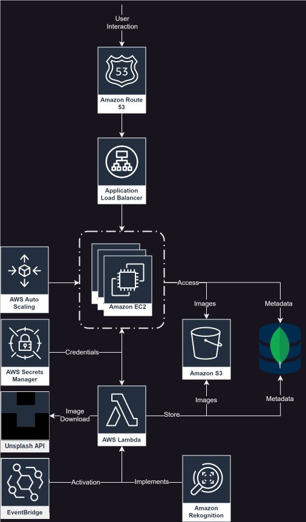

## Overview

### Introduction & Requirements

This section would provide an introduction to the project, outline the specific requirements and the scope of the cloud-based application designed to fetch, analyze, and display images from Unsplash at regular intervals.

### Component Diagram

The following diagram gives a detailed overview of all the implemented and integrated components of this project. Each of these components play a vital role in the architecture of the cloud-based application, designed to meet the specified functional and non-functional requirements. A short description with reasoning for the solutionchoice can be found in the subsequent chapters.

### EC2

Amazon EC2 (Elastic Compute Cloud) is utilized to host the application server. This server serves the web frontend for this excercise. EC2 was chosen because of its scalability, reliability, and familiarity from previous exercises.

### AWS Secrets Manager

AWS Secrets Manager is used to manage centralised sensitive data and credentials, such as the API keys for Unsplash or the MongoDB connectionstring. This choice ensures security best practices by encrypting the data and managing access. This is the only new component in this project, chosen to enhance security and extend my personal knowledge horizon.

### Unsplash

The Unsplash API is integrated to periodically fetch random images for further processing. This service was set by the excersise requirements.

### EventBridge

Amazon EventBridge is used for activationg the Lambda Function based on predefined metrics.

### AWS Lambda

AWS Lambda is used for image analysis tasks. By employing serverless functions, the system efficiently handles the execution of code in response to HTTP requests from EC2. Lambda was chosen for its cost-effectiveness, capability to scale automatically and familiarity from previous exercises.

### Amazon S3 Bucket

Amazon S3 buckets are used to store images persistently. The choice of S3 was driven by its durability, scalability, and previous familiarity, making it standard practice for storing web content and large media files in AWS.

### MongoDB

MongoDB, is used for storing metadata and analysis results. This NoSQL database is ideal for handling unstructured data like image metadata and analysis results. It was chosen for its flexibility, performance, and familiarity from previous excercises and other modules.

### AWS Auto Scaling

AWS Auto Scaling is applied on a auto scaling group containing our EC2 instances. It ensures that there are always sufficient EC2 instances available and healthy. The scaling is based on a predefined EC2-instance-template.

### Application Load Balancer

The Application Load balancer is used to evenly distribute the incoming traffic across multible EC2 instances within the Auto Scaling group.

### Amazon Route 53

Amazon Route 53 is a highly available and scalable cloud DNS web service designed by AWS and will be used to manage the DNS records. It will be configured to manage the DNS settings for the custom domain `danielb.m346.ch`. This involves creating and managing a hosted zone where the necessary DNS records are maintained. One of the key records in this setup is the CNAME-record which points the subdomain to an Application Load Balancer.

### Amazon Rekognition

The SaaS Amazon Rekognition is used to analyse the images fetched from the Unsplash-API  within the AWS Lambda Function.

## Implementation

The following chapters document the steps done for the implementation of the project, adhering to the requirements. I refrain from adding screenshots to keep the documentation short, information-dense and managable, as most of the steps below have already been documented in previous excercises and are generally SOP.

### Step 1: Configure AWS Secrets Manager

1. **Create Secrets**:
   - Navigate to AWS Secrets Manager
   - Choose "Store a new secret.
   - Select "Other type of secrets" and enter key/value pairs for Unsplash API key and MongoDB credentials (only create one Secrets Manager entry with multible key-value pairs to reduce number of calls to one)
   - Example keys: `UNSPLASH_ACCESS_KEY`, `MONGODB_URI`, etc.

2. **Set Permissions**:
   - Attach permissions to the Lambda role (`LabRole`) to access the secrets using the `Resource permissions` field of each secret (learner lab doesn't allow the usage of the IAM) using this [json file](./assets/secretsManagerResourcePermissions.json)

### Step 2: Set Up MongoDB

1. **MongoDB Connection URI**:
   - Set up a MongoDB-Cluster and DB
   - Add MongoDB-Connection-URI to Secrets Manager
   - Ensure network access is configured to allow connections from AWS resources (0.0.0.0/0 for open access)

### Step 3: Configure Amazon S3 Bucket

1. **Create S3 Bucket**:
   - Set up S3 bucket for image storage
   - Enable ACLs to manage image-specific access in the future using our lambda function
   - Disable `Block all public access`

### Step 4: Implement Lambda Function

1. **Create Lambda Layer for Dependencies**:
   - Prepare zip file containing the libraries Axios and MongoDB using the [bash](./assets/create_layer.sh) or [batch](./assets/create_layer.bat) script
   - Upload this zip file as a Lambda Layer to provide these dependencies to the Lambda function

2. **Create and Configure Lambda Function**:
   - Choose Node.js as the runtime
   - Use the execution role (`LabRole`) that has permissions to access both AWS Secrets Manager and other necessary AWS services
   - After creation attach the previously created Lambda Layer
   - Add the [code](./assets/index.mjs) in to the sourcecode of the Lambda-Function, this implementation covers the following functionalities
     - Retrieve credentials from AWS Secrets Manager
     - Fetch an image from Unsplash
     - Analyze the image using AWS Rekognition
     - Save the image to S3
     - Store the metadata and analysis results in MongoDB
   - Increase Lambda timeout value to 20 seconds to avoid premature termination
   - Test function using the `Test` button as trigger
     - Confirm result contains `"statusCode": 200`
     - Check for new image in the S3 bucket
     - Confirm metadata has been written to MongoDB collection

### Step 5: Deploy EC2 Instance for Web Server

1. **Set Up Securitygroup**:
   - Create new Security Group
     - Outbound: `::/0`
     - Inbound: `::/0:22`, `::/0:80`, `::/0:443`

2. **Set Up KeyPair**:
   - Create new KeyPair
   - Download newly created key and generate public key using `ssh-keygen -y -f myKey.pem > myKey-public.pub`

3. **Set Up EC2 Instance**:
   - Choose an appropriate Amazon Machine Image, in this case Ubuntu (use `Ubuntu 22.04` as some dependencies cant be resolved on 24.xx)
   - Select previously created security group
   - Assign an IAM instance profile (`LabInstanceProfile`) that can retrieve secrets and access necessary resources, if necessary adjust SecretsManager permissions
   - Use [this](./assets/cloud-init.yaml) startup script (Cloud-Init) to install and configure the web server and necessary software

### Step 6: Schedule Lambda Function with EventBridge

1. **Create an EventBrige**:
   - Set up a schedule for every 2 minutes using a cron expression `cron(*/2,*,*,*,?,*)`
   - Select the Lambda Function created previously as target
   - As permission select `LabRole`

### Step 7: Configure Load Balancer and DNS

1. **Set Up Load Balancer**: (as in excercise 7)
   - Create new Target Group
   - Configure an Application Load Balancer to distribute incoming traffic for scaling
   - Set up EC2-Instance template based on previously created instance
   - Create AutoScaling Group with newly create Instance-Template (here with 3 instances)

2. **Configure DNS**: (as already done in excercise 7)
   - Create a hosted zone and configure DNS settings to link your domain to the EC2 instance or load balancer (Route 53)

## Result

Working cloud environment based on the cloud component diagram following the excercise requirements:

[http://danielb.m346.ch/](http://danielb.m346.ch/)

## Reflection & Final Thoughts

- Open access to MongoDB (0.0.0.0) = unsecure, for practical implementation host mongodb on aws with specific access rules
- unfortunate and not best solution for permissions of labRole for secretsmanager access
- took very long for implementation of working ec2 instance, especially with loading of environment variables from secrets manager, setteled on a unclean but working solution
- implementation is sturdy with multible instances under a load balancer across diffrent zones
- credentials savely stored in secrets manager
- compared to previous excercises really liked this one, as we were rather free in choice of technology and solution and not following a checklist
- no images for documentation, not very detailed documentation as to wich field should be filled with wich values. in my opinion we covered more or less everything in the previous exercices and there for not necessary. i rather like the simple and straight forward documentation style as it is a great checklist for more proficient developers. if passages are unclear there is always the aws documentation for help wich i myself use often

### Reflection on Project Scope and Requirements

The practical final project task with developing a cloud-based application to fetch, analyse,  and display images from Unsplash at regular intervals, while integrating various AWS services was challenging but fun. This project not only refreshed my understanding of AWS cloud components but also pushed me to learn new components to build a robust cloud application. The structured cloud application is a nice and fresh view on new possibilities for solving backentasks.

### Architectural Choices

The chosen components AWS Lambda, EC2, S3, MongoDB, and Secrets Manager was primarily targeted for the need for scalability, manageability, and security. Utilizing AWS Lambda allows for handling image processing efficiently without the overhead of server management. S3 was an obvious choice for storing images due to its durability and ease of use. MongoDB was a no brainer because of its schema-less structure, making it suitable for storing unstructured data like image metadata. Meanwhile, AWS Secrets Manager ensures sensitive information such as API keys and database credentials are kept secure from unauthorized access by using roles.

### Learning and Challenges

The integration of these components, while educational, brought with it its own set of challenges. Particularly,  the setup of AWS Secrets Manager to handle credentials securely was a steep learning curve. Handling permissions and ensuring secure access to these secrets from other AWS services like Lambda required careful attention to IAM roles and policies.

The dynamic fetching and displaying of images on a webpage hosted on a EC2 instance with a real-time data flow across services, provided first experiences with developing responsive cloud-based applications. However, managing environment variables across different services, especially for the EC2 instance, was rather tricky, requiring a deeper dive into Linux system management and script debugging.

### Security and Scalability

The public open access to MongoDB is a significant concern, as it exposes the database to potential security threats. In a production environment, it would be crucial to restrict access to known and secure IP addresses, desirably as an AWS Service. Additionally, implementing an Application Load Balancer helped reinterating the understanding of traffic distribution and auto-scaling capabilities of previous tasks, ensuring the application can handle increased loads efficiently.

### Documentation and Process

While the documentation process has been done minimalisticly, it serves the purpose of this educational exercise. It allowes for focus on practical implementation rather than getting fighting with excessive details. Future iterations of alike projects could benefit from a more detailed documentation, especially for less experienced developers who might need more guidance on specifics like configuration settings and troubleshooting. Never the less serves this documentation the intended pourpuse and is more than enough for solving this excercise, especially in combination with the official AWS documentation (wich is always up to date).

### Overall Experience and Satisfaction

This project was really fun as it involved the essence of cloud computing — from setup to deployment and scaling. The freedom to choose technologies and services as well as  the challenge of integrating them provided a encompassing learning experience that was both challenging and rewarding. The project not only increased my technical skills but also tested my patience.
