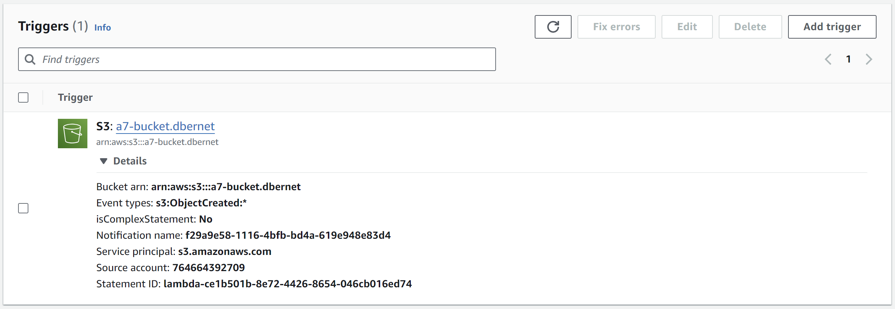

## A: Preparation: Create an S3 Bucket

### Object Ownership and ACL

When setting an S3 Bucket, it is essential to enable ACLs in the Object Ownership section.  Without ACLs, all files within the bucket inherit the bucket-permissions. However, for this task, I want to be able to set permissions on a file level to decide which objects should be public or private.

### Disabling Block All Public Access

It's necessary to disable the `Block all public access` setting, wich is essential for allowing chosen objects to be accessble.

## B: Create the Function

### Lambda Function

To create a new Lambda function, select "Create function" and choose `Node.js 20.x` as runtime. Change the default execution role to "Use an existing role" and pick `LabRole`, which allows the creation, definition, and execution of Lambda functions.

### Lambda Trigger

- 1. Select "Add trigger"
- 2. Select "S3"
- 3. Select bucket
- 4. Define event types (in this case "All object create events")

### Functionality

For functionality the following [code](./assets/index.mjs) is used.

When an object is created in the S3 bucket, it triggers the Lambda function. This function contains the code that first checks if the object in the S3 bucket is the correct MIME-Type, such as JPEG or PNG. By extracting this label from the object's metadata. If the object does not meet these criteria, the function stops, and no further processing is done. If the MIME-type is matches, the image is sent to the Rekognition-service, which analyzes the image to determine if it contains no, one, or multiple celebrities. If the image does include one or more celebrities, the function sets the image-access control list to `public-read`.

Further, the function's timeout setting should be adjusted to allow more time for execution, as the analysis of some images may take longer and could be interumpted by a timeout. This can be adjusted in the `General configuration` by editing the timeout to approximately 10 seconds.

Finally objects can be uploaded to the bucket. For testing, a Word document, an image with no celebrity, one with a celebrity, and one with multiple celebrities were uploaded. A screen recording demonstrated the functionality of the Lambda function. According to the desired outcomes, public links were created for the images with celebrities.

A screen recoding of the lambda-function at work can be found [here](./assets/lambda-at-work.mkv). The link to the published `one-celebrity.jpg` is as follows;

- [https://s3.amazonaws.com/a7-bucket.dbernet/one-celebrity.jpg](https://s3.amazonaws.com/a7-bucket.dbernet/one-celebrity.jpg)

### Testing

Performing the tests using the predefined json-triggers, deposited [here](./assets/testEvents/), return the following results.

#### Test Event False Format

#### Test Event Multible Celebrities

#### Test Event No Celebrity

#### Test Event One Celebrity

### Further Usecase

I think a useful enhancement of this lambda function would be to integrate it in to a profile-picture upload, where it would detect missuse of pictures from public figures and if the test passes to scale and convert it to a set size(es) and format(s) for storage and use within an application or ec2 web server.
