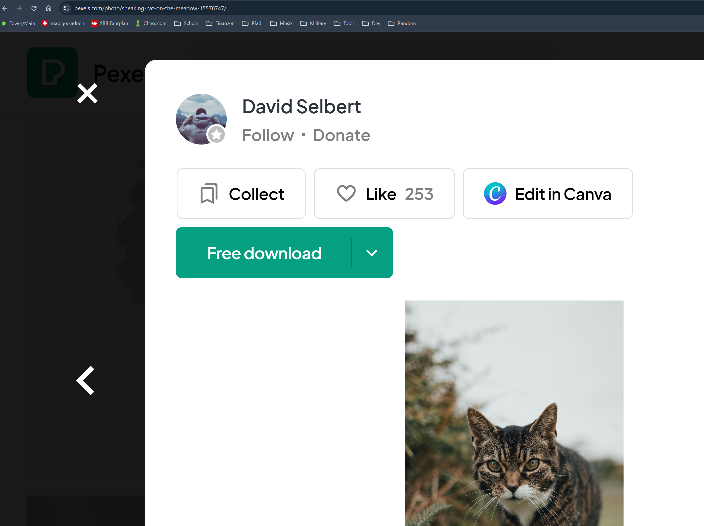
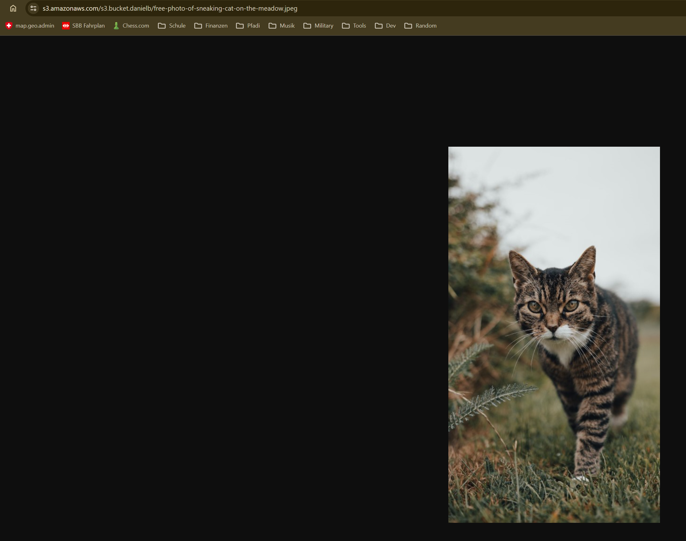
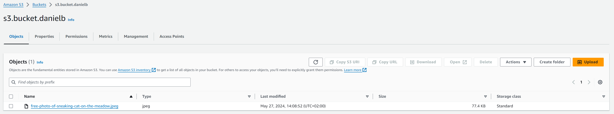
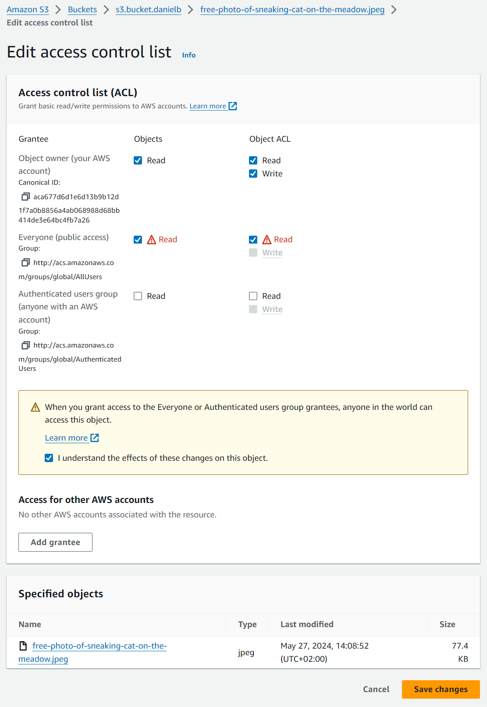
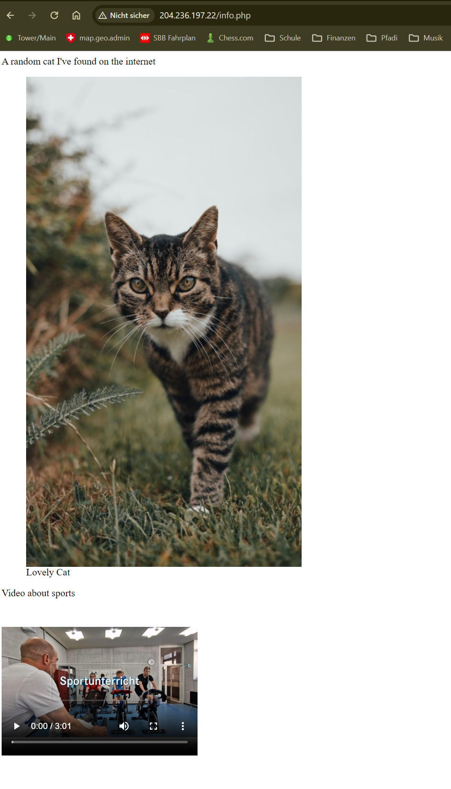
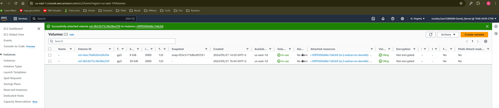
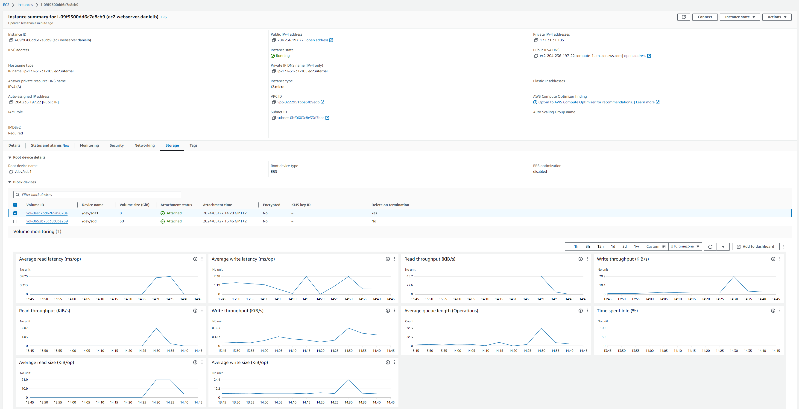

## A: Hosting Images on S3

For this excercise, we configured an S3 bucket to store static content, commonly used for backups and archiving due to its secure and redundant storage capabilities. This setup supports Content Delivery Networks (CDN), which use assets like images, JavaScript, and CSS to speed up content delivery and reduce website latency. The image used in the following context has been downloeaded from [Pexels](https://www.pexels.com/photo/sneaking-cat-on-the-meadow-15578747/).



The bucket-creation-configuration can be found under `/assets`, specifically `bucket_creation1.png` through `bucket_creation3.png`.

The following screenshots containn the stock-image hosted on the S3-Bucket as well as displaying the buckets content.





The following adjustments, provided in the list below, need to be made to the permissions for any uploaded content. The bucket is set to allow unrestricted query access within the bucket-creation-configuration (view `/assets/bucket_creation2`), each object is then tasked with enforcing its own access controls.

- Navigate to the `Permissions` tab of the bucket-content
- Enable both `Read` permissions under `Everyone (public access)`



## B: Embedding the Image in a PHP Site

To enable a website to retrieve static content from an S3 bucket, it is essential first to ensure that the content is public, as explained and completed in Task A. A web server can now be established using an EC2 instance, utilizing a Cloud-init file that contains the configuration for the server. The ec2-instance-creation can be found under `/assets` within `ec_instance_creation1.png` through `ec_instance_creation4.png`.

The following two code snippet illustrate how to embed static content in HTML (done using the `cloud-init.yaml` file). Specifically the stock-imaged hosted on the S3-bucket as well as the sports-video from google-storage.

```html
<figure>
    
    <figcaption>Lovely Cat</figcaption>
</figure>
<p>Video about sports</p>
<video width="320" height="240" controls>
<source src="https://storage.googleapis.com/ch_gibz_app_video/2023/02_Sportunterricht.mp4" type="video/mp4">
Your browser does not support the video tag.
</video>
```

Once the EC2-instance is launched, navigate to the IP specified within the EC2-instance and append the filename, specified within the `cloud-init.yaml` code. The result should look somethin like this:

- `http://204.236.197.22/info.php`



The Cloud-Init file is not discussed further as it was already covered in previous tasks. However, I encountered a minor error initially. Instead of placing the public key generated by `ssh-keygen -y -f my-key-pair-danielb-1.pem > my-key-pair-danielb-1-public.pub` in the cloud-init.yaml, I mistakenly included my private SSH key. Nevertheless, the cloud-init configuration of a running ECS instance can be easily modified with the following commands allowing me to correct my mistake.

```bash
cd /var/lib/cloud/instances/<instance-id>
sudo nano user-data.txt
```

## C: Elastic Block Storage (EBS)

Storage expansion on an EC2 instance is straightforward. Navigate to the `EC2` section and select `Volumes` to create and manage *Elastic Block Store* volumes. Here, you can create a new volume and attach it to an instance by selecting it and applying the `Actions` command to attach. These steps are documented within the screenshots `abs_create_volume.png` and `attach_ebs_tp_ec2-instance.png` in the `/assets` directory

It is essential to carefully select the device name for the volume. For Linux systems, the recommended device names are within the range `/dev/sd[f-p]` to avoid conflicts with the root directory or other system limitations that could lead to operational issues.

After attaching the volume, verify the integration by examining the operational status of the EC2 instance. This ensures that the newly expanded storage is functioning as expected, enhancing the instance's capacity to manage and store data efficiently.

The following two screenshot depict the volumes-dashboard and the specific es2-instance dashboard used within this exercise.





During this exercise with AWS Elastic Block Storage (EBS), I learned a lot about how to easily adjust cloud storage to what's needed for an EC2 instance. A big takeaway was making sure to name storage volumes correctly to avoid any technical mix-ups.

I also picked up some handy tips, like making regular backups (snapshots) of the storage volumes. This is really helpful if something goes wrong because you can restore everything back to how it was, something I'm not used to deploying on a self-hosted linux-server. I've found thzat it's good to choose the right type of storage (for exaple general purpose SSDs like gp2 or gp3 or provisioned IOPS SSDs like io1 and io2 and so forth) depending on what you need it for, which helps save money and keeps things running smoothly.

## D: Properties of Different Types of Storage

Storage Specifications and Comparisons:

|| EBS root volume| Additional EBS volume| S3 bucket|
| ------------------- | ----------------- | --------------------- | ---------------- |
| **Type**| Hot| Warm| Warm|
| **Persistency**| Yes| Yes| Yes|
| **Comparable services (Google Cloud)**| Persistent Disk| Persistent Disk| Cloud Storage|
| **Comparable services (Azure)**| Azure Managed Disks| Azure Managed Disks| Azure Blob Storage|

Explanation:

- **EBS Volumes**: Both volumes are persistent, ensuring data is maintained across reboots or failures. The root volume is 'hot' because it handles frequent accesses due to system operations. The additional volume is 'warm', used less frequently but still important for active data storage.

- **S3 Bucket**: This is classified as 'warm' because it is accessible and used for data storage that doesn’t require instant access like EBS. S3 is persistent, great for storing large amounts of data securely and cost-effectively.

Additional Insights:

EBS is ideal for high-performance tasks that require quick data access. In contrast, S3 is better suited for storing large files and backups where immediate access is less critical. When comparing with other providers, Google Cloud’s Persistent Disk and Azure’s Managed Disks offer similar performance and features to AWS EBS, while Google Cloud Storage and Azure Blob Storage align well with AWS S3 for object storage solutions.

## Final remarks

Within the `/assets` directory are further screenshots and files deposited wich were made withint he process of this exercise yet aren't mentioned within this documentation. These files are saved to answer questions, reproduce specific steps of the exercise or simply as a basis for further discussion.
