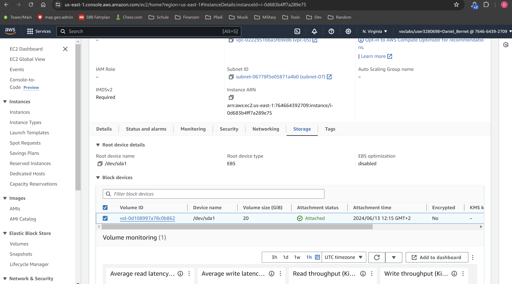

## A: Preparations: MongoDB and Webserver

### Reverse Proxy

A reverse proxy is a server that sits between a client and one or more backend servers/instances. It accepts/intercepts requests from clients and forwards them to the suppsed backend. Once the backend server has processed the request, the reverse proxy collects the response and sends it back to the client. The reverse proxy acts as a gateway/middleman, handling incoming traffic and distributing it to different servers.

### EC2 Instance

### Hints and best practices

- Always use strong passwords
- Keep Software updated
- Set up basic logging in NGINX for debugging and monitoring
- There are a lot of useful tools for monitoring and keeping track of what's going on
- Always keep logs
- Document every change of configurationa, software and setup

## B: Vertical Scaling

### Extending Disk Size

To change the disksize of a running EC2 instance go to the associated storage tab and select the instance-volume. By selecting the modify button the disksize of the volume can be changed. This change directly takes affect for the volume and there for the EC2-instance without disrupting functionality but setting the it in to the (temporary) `optimising` state. The following list provides a breakdown of the previously described steps.

- 1. Select instance
- 2. Switch to storage tab
- 3. Select the desired associated volume
- 4. Press actions
- 5. Press modify and enter the desired size and apply changes

Unfortunately I've missed taking a screenshot before increasing the size of the volume and the disksize is only increasable not decreasable. There for I'm missing the screenshot of the standart sized volume.

### Change Instance Type

To change the type of an instance the instance has to be stopped, interrupting the functionality. After stopping open the detail view and select actions and instance setting. Within this contextmenu select change instance type. Here you can select the desired instance type, in this case `t2.medium`. The following list provides a breakdown of the previously described steps.

- 1. Stop instance
- 2. Select instance
- 3. Press actions
- 4. Select instance settings
- 5. Select instance type
- 6. Select the desired instance type and apply changes
- 7. Restart instance

## C: Horizontal Scaling

### Overview

Initially, I created two new EC2 instances in different Availability Zones (`us-east-1b` and `us-east-1c`) to ensure redundancy in case one zone fails. A single security group was configred for both instances to simplify setup. This security group allows HTTP and SSH traffic.

### Setting Up a Target Group

A target group was established to define where the load balancer should direct traffic. It specifies:
- **Port 80** for HTTP traffic to the instances
- A health check using the API endpoint `/shop/alive` which returns a HTTP 200 status, indicating that the instances are running correctly

### Creating a Load Balancer

An Application Load Balancer was created with the following settings:
- **Internet-facing** to receive a public DNS (application load balancer)
- Security group set up earlier selected
- Network mapping included the availbility zones of the EC2 instances

Once the load balancer is operational and the health checks are positive, the application can be accessed via the load balancer's domain.

### DNS Configuration

To point the custom domain `http://shop.m346.ch` to the load balancer we have to configure a CNAME record in my DNS settings to point to the load balancer domain. As an exercise I've gone and added the subdomain `http://m346.dbernet.ch` to my domain with the DNS-record for the loadbalancer included with the roating to the `/shop/alive` endpoint. Now the loadbalancer can directly be accessed using this domain.

## D: Auto Scaling

To configure autoscailing a template is needed. As I've already created a template for exercise C I'm not going in to detail about template creation.

- Select `Auto Scaling groups` from the sidemenu
- Choose the launch template
- Select the same availability zones as those defined in the load balancer
- Choose the load balancer that was set up previously to distribute incoming traffic
- Confirm that the auto scaling group is associated with the correct VPC, avoid selecting any VPC-Lattice options if only one VPC is in use
- Turn on health checks provided by elastic load balancing (will automatically start a new instance if the health check fails)
- Define the minimum, maximum, and desired number of instances

The following image depicts the autoscaling initialized with a desired groupsize of 5 and then changed to 2. The autoscaling automatically manages the targetgroup size and instances.

## Additional Task E for Pros

The primary issue is the hardcoding of credentials, specifically in relation to the MongoDB connection string. Hardcoding credentials embeds sensitive information directly within the application code or scripts, making it vulnerable and inflexible to changes in the database endpoint or credentials. Should the database connection details change, the configuration script would require manual updates, introducing potential downtime and human error.

A more robust and error-resistnt and clean approach would involve abstracting the credentials from the codebase. This can be achieved using one of the following solutions. 

1. **External Configuration Files:** Store the credentials in an external `.env` file that the application reads at runtime. This method isolates sensitive information from the codebase and simplifies credential change without needing to re-deploy the application
   
2. **AWS Secrets Manager:** AWS provides the [AWS Secrets Manager](https://docs.aws.amazon.com/secretsmanager/latest/userguide/intro.html) service to manage database credentials securely.  This service not only helps in storing and retrieving credentials but also handle permissions and access and integration with other AWS services
